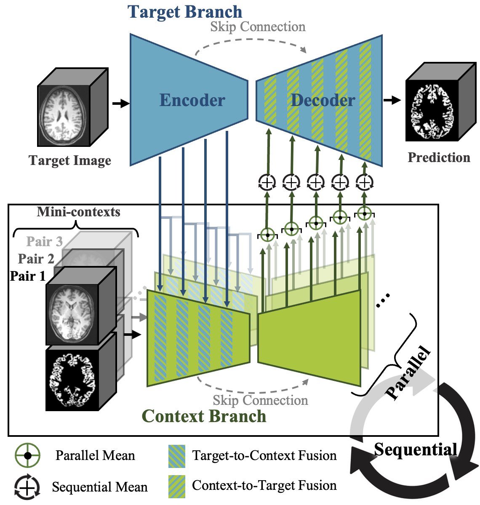

# Universal Model for Neuroimaging

Welcome to the official GitHub repository for **Neuroverse3D**, a In-Context Learning (ICL) universal model for neuroimaging in 3D.

This repository provides a demonstration notebook (`Demo.ipynb`) to showcase Neuroverse3D's capabilities across various neuroimaging tasks (e.g. segmentation, denoising, modality transform, bias correction) and to illustrate its flexibility.

<div align="center">
   <br>
</div>


## Introduction

As a **universal model**, Neuroverse3D demonstrates robust **cross-center generalization** and proficiency across a wide range of neuroimaging tasks without requiring task-specific retraining. This offers a significant advantage for practical applications in diverse clinical and research settings.

Neuroverse3D is designed to address the challenge of applying In-Context Learning to 3D medical images.  It overcomes the significant memory limitations of ICL models by introducing the **adaptive parallel-sequential context processing (APSP)** approach.

## Getting Started

The `Demo.ipynb` notebook provides hands-on demonstrations of Neuroverse3D's capabilities.  Follow the steps below to run the notebook and explore the model's performance on different tasks.

**Running the Demo:**

1. **Environment Setup:** Ensure you have Python and PyTorch installed, along with the required libraries listed in `requirements.txt`. You can install dependencies using pip:
    ```bash
    pip install -r requirements.txt
    ```
    Alternatively, you can directly download and use our provided [Docker image](www.ggd) to run the model.
    
2. **Download Checkpoint and Demo Images:**

   - **Pretrained Checkpoint:** Download the Neuroverse3D checkpoint (`neuroverse3D.ckpt`) from [Google Drive](https://drive.google.com/drive/folders/1NrORQxSKB5jl-cvUJ2eATU1FP3EjtSUc?usp=share_link) and place it in the `./checkpoint/` directory.
   - **Demo Images:** Download the demo images from [Google Drive](https://drive.google.com/drive/folders/1h4x7WtG_GDlckcR4yAI2XZdwnjBOUEt9?usp=share_link) and place them in the `./Demo_data/` directory.

3.  **Run the Jupyter Notebook:** Open and run the `Demo.ipynb` notebook using Jupyter or JupyterLab.

## Citation

If you find Neuroverse3D useful, please cite our paper.