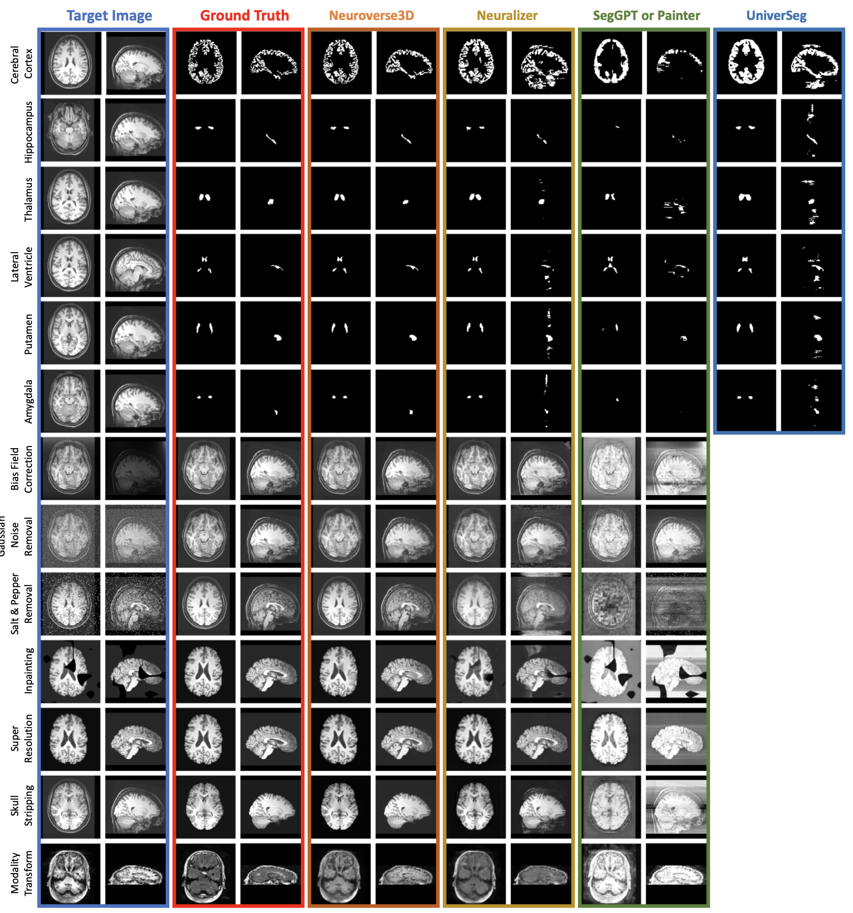

# 🧠 Neuroverse3D: A Universal Model for 3D Medical Imaging

Welcome to the official repository of **[Neuroverse3D](https://arxiv.org/pdf/2503.02410v1)** — a universal In-Context Learning (ICL) model designed for diverse **3D medical imaging** tasks.  

🎉 **Our paper has been accepted to ICCV 2025!** 🎉

---

## 🚀 What Can Neuroverse3D Do?

Neuroverse3D is trained on neuroimaging data and can perform a wide range of neuroimaging tasks including:

- 🔍 **Arbitrary segmentation**
- 🔁 **Image Transformation**
- 🌅 **Image Enhancement**

<div align="center">
   <br>
</div>

> ⚠️ *Note: While trained on brain images, the model demonstrates some ability on other organs (e.g., abdomen), though the performance is limited and not yet reliable.*

---
## 📘 Quick Start
This repository provides a tutorial (`Demo.ipynb`) to showcase Neuroverse3D's capabilities across various neuroimaging tasks and to illustrate its flexibility. 

<!-- <div align="center">
   <br>
</div> -->

---
## Introduction

As a **universal model**, Neuroverse3D demonstrates robust **cross-center generalization** and proficiency across a wide range of neuroimaging tasks without requiring task-specific retraining. This offers a significant advantage for practical applications in diverse clinical and research settings.

Neuroverse3D is designed to address the challenge of applying In-Context Learning to 3D medical images.  It overcomes the significant memory limitations of ICL models by introducing the **adaptive parallel-sequential context processing** approach.

## Getting Started

The `Demo.ipynb` notebook provides hands-on demonstrations of Neuroverse3D's capabilities.  Follow the steps below to run the notebook and explore the model's performance on different tasks.

**Running the Demo:**

1. **Environment Setup:** Ensure you have Python and PyTorch installed, along with the required libraries listed in `requirements.txt`. You can install dependencies using pip:
    ```bash
    pip install -r requirements.txt
    ```
    Alternatively, you can directly download and use our provided [Docker image](https://drive.google.com/file/d/1bAoCM2JzfS0cZCQOZFIVGWLnQBDA73V3/view?usp=share_link) to run the model.
    
2. **Download Checkpoint and Demo Images:**

   - **Pretrained Checkpoint:** Download the Neuroverse3D checkpoint (`neuroverse3D.ckpt`) from [Google Drive](https://drive.google.com/file/d/1ER_mV2CCsdnF-q3Aoy7loJ2DZXI95M9M/view?usp=drive_link) and place it in the `./checkpoint/` directory.
   - **Demo Images:** Download the demo images from [Google Drive](https://drive.google.com/file/d/1H7sq-KeK39OfILdoY7MALO6sQqrgaVwf/view?usp=drive_link) and place them in the `./Demo_data/` directory.

3. **Run the Model:**

   - **Jupyter Notebook:** Open and execute the `Demo.ipynb` notebook using Jupyter or JupyterLab for an interactive demonstration.

   - **Direct Model Execution:** Alternatively, you can run the model directly using the following Python code:

    ```python
    from neuroverse3D.lightning_model import LightningModel
    model = LightningModel.load_from_checkpoint(checkpoint_path)

    # To perform a prediction (L = context size, spatial dimensions: H = W = D = 128)
    mask = model.forward(
    target_in,         # torch tensor (Batch, 1, H, W, D)
    context_in,        # torch tensor (Batch, L, 1, H, W, D)
    context_out,       # torch tensor (Batch, L, 1, H, W, D)
    gs=2,              # Mini-Context Size (positive integer). Smaller values reduce memory usage but decelerate processing.
    )  # -> (Batch, 1, H, W, D)

    ```
    Ensure all input images are min-max normalized to [0, 1].

## Citation

If you find Neuroverse3D useful, please cite our paper.

## Acknowledgements
This repository benefits from the excellent work provided by [UniverSeg](https://github.com/JJGO/UniverSeg/tree/main) and [Neuralizer](https://github.com/SteffenCzolbe/neuralizer). We extend our gratitude for their significant contributions to the field.

