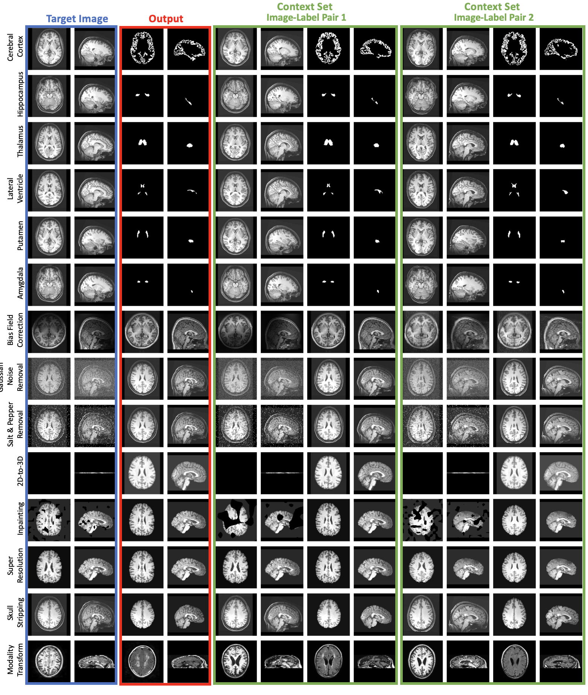

## What Can Neuroverse3D Do?

Neuroverse3D is trained on neuroimaging data and can perform a wide range of neuroimaging tasks without retraining including:

- 🔍 **Arbitrary segmentation**
- 🔁 **Image Transformation**
- 🌅 **Image Enhancement**
  
Just need a few image-label pairs as context!

    

> ⚠️ *Note: While trained on brain images, the model demonstrates some ability on other organs (e.g., abdomen), though the performance is limited and not yet reliable.*